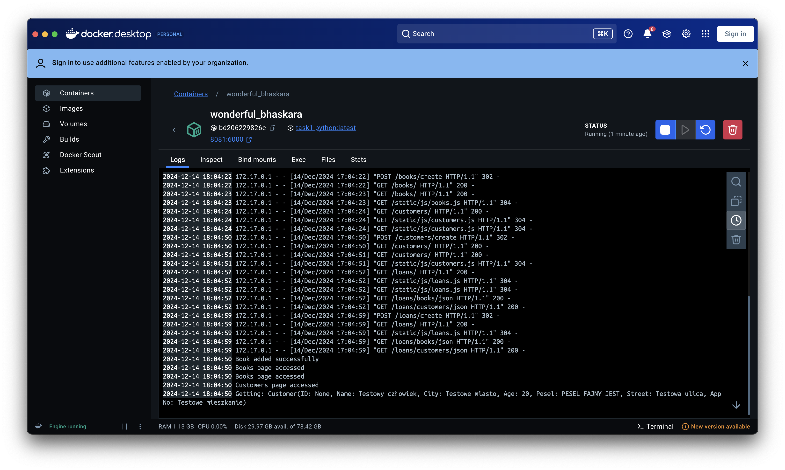
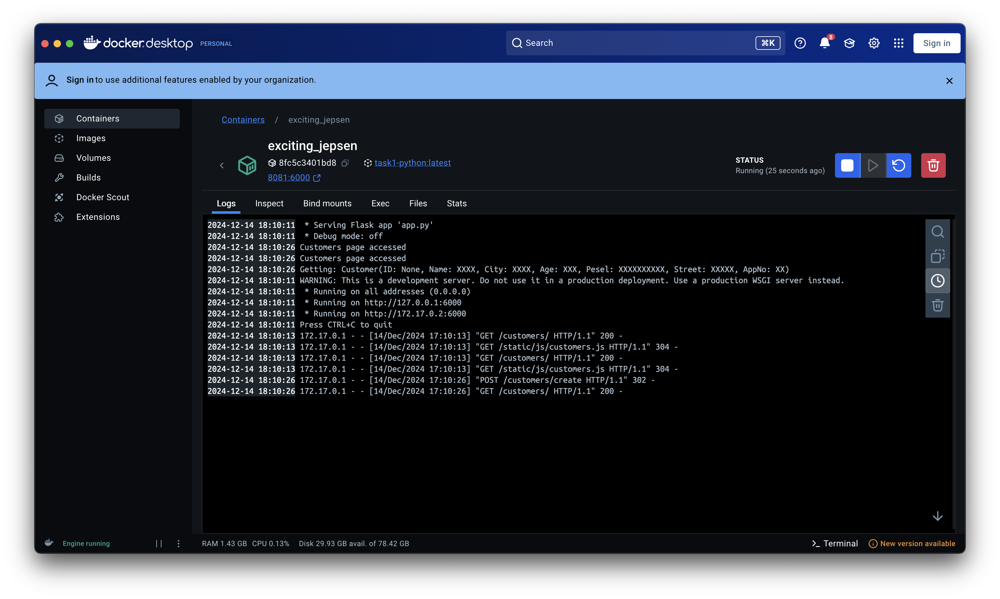
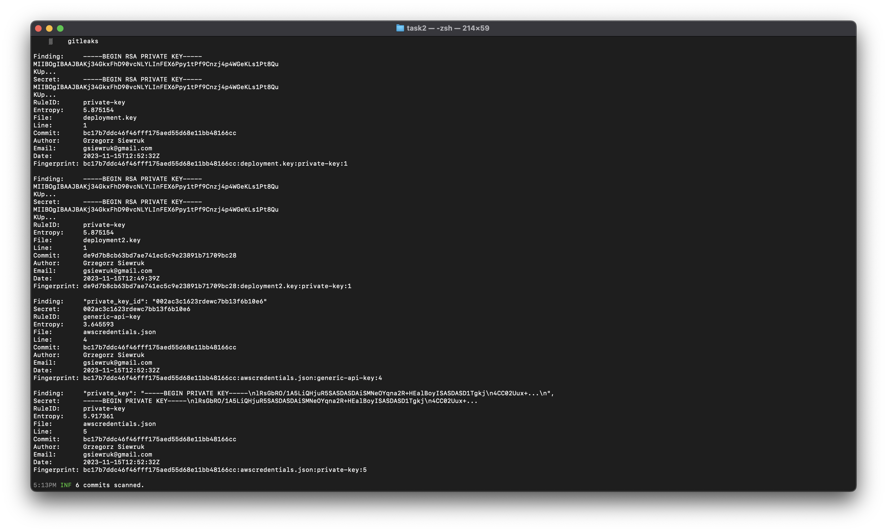
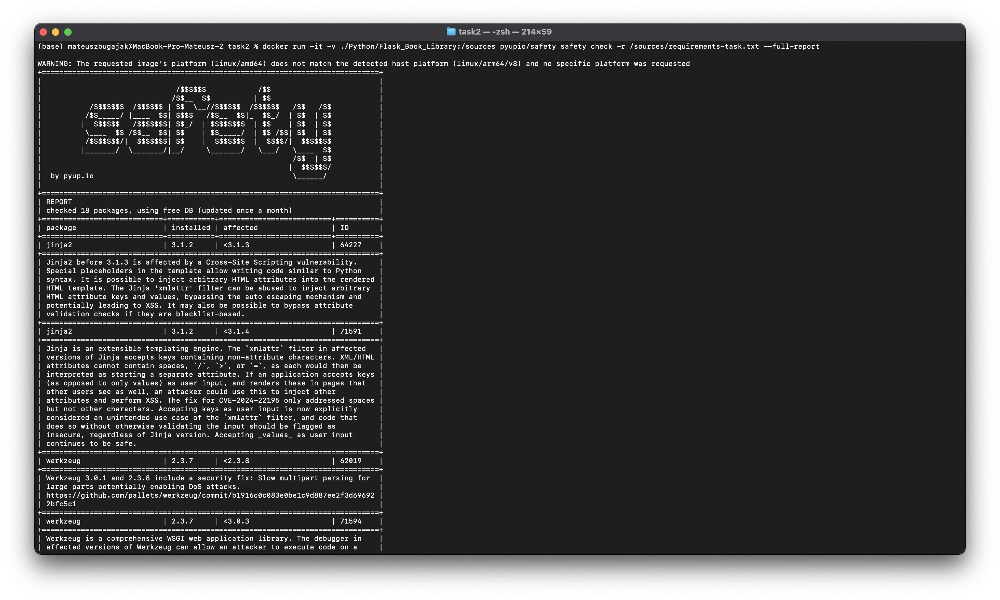

# Security By Design - Zadanie 2

## Zadanie 1 -

Weryfikacja wycieku wrażliwych danych

**Cel:** Celem zadania jest przetestowanie aplikacji w celu weryfikacji, czy w logach znajdują się wrażliwe dane, które
niekoniecznie powinny być zawarte w logach aplikacyjnych.

### Znalezione dane wrażliwe:

Analizując logi aplikacji Python, zauważono dane wrażliwe w postaci danych dodawanego klienta.

Zabezpieczono aplikację, anonimizując logi poprzez modyfikację pliku customers/models.py

## Zadanie 2 - weryfikacja wycieku sekretów

**Cel:** Celem zadania jest weryfikacja, czy w repozytorium (i jego historii) znajdują się sekrety i/lub hasła, które
zostały `hardcodowane` w kodzie źródłowym lub jednym z plików w przestrzeni dyskowej

### Znalezione sekrety i hasła:

W aplikacjach znaleziono 4 klucze, w plikach

- deployment.key
- deployment2.key
- awscredentials.json
- awscredentials.json

Niektóre klucze zostały powielone (deployment.key i deployment2.key).

Wszystkie wystąpienia nie wydają się
false-positive'ami. https://github.com/bugajakmateusz/tbo-task2/commit/fd6740006a794a1a8bb0cd7d8a2a6ee95d8cbec3#diff-a3b0fe5dcfc963cf45af52a02d6e4e63cb48a15f63a7652f12291405e4cde7a0

## Zadanie 3 - weryfikacja bezpieczeństwa bibliotek OpenSource wykorzystywanych w projekcie

**Cel:** Uruchomienie weryfikacji bezpieczeństwa bibliotek OpenSource, które są wykorzystywane w projekcie w celu oceny
bezpieczeństwa badanej aplikacji.

W aplikacji znaleziono 8 podatności.

Tabelka przedstawia podsumowanie najpoważniejszej podatności.

| Podatność     | Biblioteka | Krytyczność | Base Score | Wymagany warunek do wykorzystania | Wykorzystanie w aplikacji | Prawdopodobieństwo wykorzystania |
|---------------|------------|-------------|------------|-----------------------------------|---------------------------|----------------------------------|
| CVE-2019-8341 | Jinja2     | Krytyczna   | 9.8        | Uruchomienie metody `from_string` | Nie                       | Minimalne                        |
